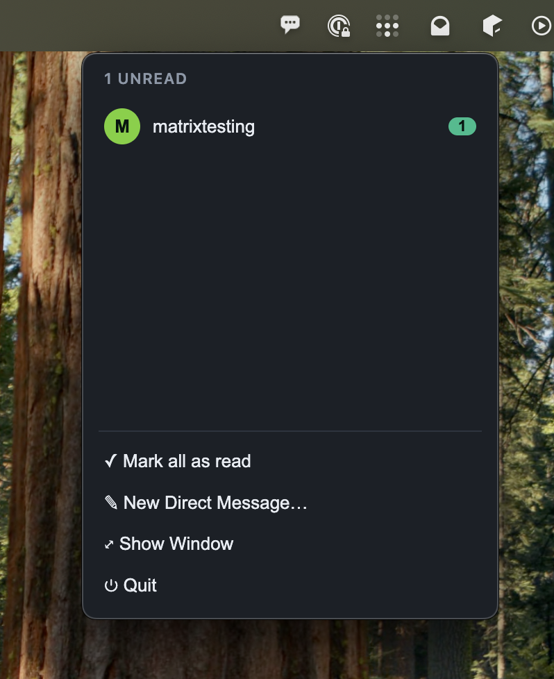

# Matrix Client — a `deno desktop` demo

A small native desktop **Matrix chat client**: a Chromium webview UI driven by a
Deno process, using the official [`matrix-js-sdk`](https://github.com/matrix-org/matrix-js-sdk).

Login → room list → live timeline → send, with markdown, end-to-end encryption,
and the desktop-native chrome `deno desktop` exposes: a **tray** with a
click-to-open menu, a **dock/taskbar unread badge**, a **native menu bar**, and
native **notifications**.

## Screenshots

<!-- Drop screenshots into screenshots/ and they'll show up here. -->

| Main window | Login |
| --- | --- |
|  |  |

| Tray menu | Notification |
| --- | --- |
|  |  |

## Architecture

The **Matrix SDK runs in the Deno process**, not the webview. The webview is a
thin renderer that calls bindings and listens to a live event stream.

| File | Side | Responsibility |
| ---- | ---- | -------------- |
| `matrix.ts` | Deno | `MatrixEngine` — all `matrix-js-sdk` logic (login, sync, rooms, timeline, send, crypto, markdown). Framework-agnostic, so it's unit-testable headlessly. |
| `main.ts` | Deno | Serves the UI + an SSE stream (`Deno.serve`), opens the `Deno.BrowserWindow`, exposes the engine as `bind()` handlers, and owns the desktop chrome (tray, dock badge, menu bar, notifications, window lifecycle). |
| `app.js` | Webview | No SDK. Calls bindings, subscribes to SSE, renders the UI. |
| `index.html`, `styles.css` | Webview | Static shell, embedded into the binary via `import … with { type: "text" }`. |
| `icon.png` | — | App icon (build-time). The tray icon is generated in code. |
| `test_matrix.ts` | — | Headless verification harness for the engine. |

`matrix-js-sdk@41.6.0` and `marked@14` are pulled via `npm:` and bundled by
`deno desktop`.

**Webview → Deno** (`win.bind`): `login`, `autoStart`, `getRooms`, `selectRoom`,
`sendMessage`, `markRead`, `setActiveRoom`, `logout`, `log` — plus the tray
panel's `trayData` / `trayOpen` / `trayMarkAll` / `trayNewDm` / `trayShow` /
`trayQuit`.

**Deno → Webview** (Server-Sent Events on `GET /events`): `sync`, `rooms`,
`timeline`, `decrypted`, `openRoom`, `nav`, `loggedOut`. There's also a
`GET /media?mxc=…` route that proxies authenticated avatar thumbnails.

## Prerequisites

This app needs the **`deno desktop`** binary, which only exists on the
in-development branch `desktop-framework-hmr` of `crowlkats/deno` — it is **not**
in any released Deno. Build it from source:

```bash
git clone --recurse-submodules --branch desktop-framework-hmr \
  https://github.com/crowlkats/deno.git deno-desktop
cd deno-desktop
# Sibling path dependency: libsui (`../sui`), pinned to 0.13.0:
git clone https://github.com/denoland/sui ../sui   # check out the 0.13.0-era commit
cargo build --bin deno                              # debug build is fine
export PATH="$PWD/target/debug:$PATH"
deno desktop --help
```

Build prerequisites: Rust stable, a C/C++ compiler, `cmake`, and `protoc`. The
first `deno desktop` run downloads a prebuilt **WEF** UI backend (checksum-verified;
needs network the first time).

> A from-source `deno` also needs `libdenort` (the runtime base the app `.so` is
> appended to). There's no published artifact for a dev version, so build it
> yourself: `cargo build -p denort_desktop` (produces `libdenort.{so,dylib}` next
> to the `deno` binary, or point `DENORT_DESKTOP_BIN` at it).

## Run

From this directory:

```bash
deno task dev
```

which runs, with hot reload:

```bash
deno desktop --hmr --conditions=matrix-org:wasm-esm \
  --allow-net --allow-read --allow-write --allow-env main.ts
```

Drop `--hmr` for a plain run. `--conditions=matrix-org:wasm-esm` selects the
crypto library's ESM-wasm loader (see [Encryption](#encryption)). On a headless
box the webview needs a display — run under `xvfb-run`.

### Build a distributable

```bash
deno task bundle   # → MatrixClient.app / .AppImage / dir, per platform
```

The UI assets are embedded into the binary, so the bundle is self-contained.

## Using it

1. **Login** — homeserver defaults to `https://matrix.org`. Enter a username
   (`alice` or `@alice:matrix.org`) and password, or expand *"sign in with an
   access token"*. The session is persisted on disk by the Deno process, so a
   relaunch skips re-login.
2. **Rooms** — joined rooms appear in the sidebar with avatars and unread badges.
3. **Timeline** — recent history loads and updates live.
4. **Send** — **Enter** sends (Shift+Enter for a newline). **Markdown** is
   rendered to a Matrix `formatted_body` on send, and incoming `formatted_body`
   HTML is rendered through an allowlist sanitizer (the Matrix HTML subset only;
   scripts/unknown tags/unsafe URLs stripped, links don't navigate the app away).

### Desktop features

- **Tray** — a speech-bubble status-bar icon (a macOS template image).
  **Left-click** opens a popover menu (`Tray.attachPanel`) listing your **unread
  rooms** (click to jump in), plus *Mark All as Read*, *New Direct Message…*,
  *Show Window*, *Quit*; it re-renders live off the SSE stream. **Right-click**
  shows the equivalent native menu.
- **Menu bar** (`win.setApplicationMenu`): *File* (New DM `⌘N`, Sign Out),
  *Edit* (system cut/copy/paste/select-all for the composer), *View*
  (Next/Previous Room `⌘]`/`⌘[`, Mark All as Read `⇧⌘A`, Reload, Toggle DevTools),
  *Help*, and the macOS app menu.
- **Unread badge** — total unread pushed to `Deno.dock.setBadge()`.
- **Notifications** — fired from the Deno process for a message in a room that
  isn't focused/open; clicking one focuses the window and opens that room.
- **Window close** hides to the tray (use the tray's *Quit* to exit).

## Encryption

The engine initializes the Rust crypto stack (`initRustCrypto`, in-memory store
— Deno has no IndexedDB). When crypto is available, encrypted rooms work:
incoming messages decrypt (a *"🔒 Decrypting…"* placeholder is replaced in place
via `Event.decrypted`), and you can send to encrypted rooms (Megolm). Keys live
for the session, so pre-launch history may show *"🔒 Unable to decrypt"*. No
device verification / cross-signing.

> **Current limitation in the compiled GUI.** Crypto works under `deno run`
> (verified by `test_matrix.ts`), but **`deno desktop` drops `--conditions` on
> its compile path**, so the compiled app loads the crypto library's `node`
> entry, whose `fs.readFile` of the embedded `.wasm` returns `NotSupported` —
> encrypted rooms fall back to read-only (*"🔒 Encrypted message"*, composer
> locked). The `--conditions=matrix-org:wasm-esm` flag is already wired up and
> will enable E2EE in the GUI with no app change once `deno desktop` threads it
> into the compile.

## Verifying headlessly

The Matrix logic can be verified without a display against any homeserver:

```bash
deno run --conditions=matrix-org:wasm-esm -A test_matrix.ts http://localhost:8008
```

It registers two users and asserts login, sync, room list, live send/receive
both ways, and **end-to-end encryption** (encrypted room → the other user
decrypts). Exit code 0 = all checks passed. (Point it at a dev homeserver with
open registration, e.g. a local Synapse.)

## Known `deno desktop` rough edges

Hit while building this demo (this branch is in development):

- `deno desktop` (compile) ignores `--conditions`, unlike `deno run` — blocks the
  E2EE wasm loader above.
- deno-compile can't read embedded files via Node `fs.readFile`/`readFileSync`
  (`NotSupported`), breaking npm wasm packages that use the Node loader.
- `Deno.dock.setBadge(null)` renders a literal `"null"` on macOS — pass `""` to
  clear.
- The tray's native menu is right-click only (`just-wef` routes left-click to the
  `click` handler), so the left-click menu is a popover.
- A from-source `deno` has no downloadable `libdenort`, and building the
  `denort_desktop` cdylib needs a `rusty_v8` built with `-DV8_TLS_USED_IN_LIBRARY`
  (the prebuilt one fails to link into a shared library).

## Security

No credentials are committed. The access token / user id / device id are stored
only on your machine, in `~/.matrix-client-demo.json` (mode `0600`), written by
the Deno process. *Sign out* calls `/logout` and deletes the file.
